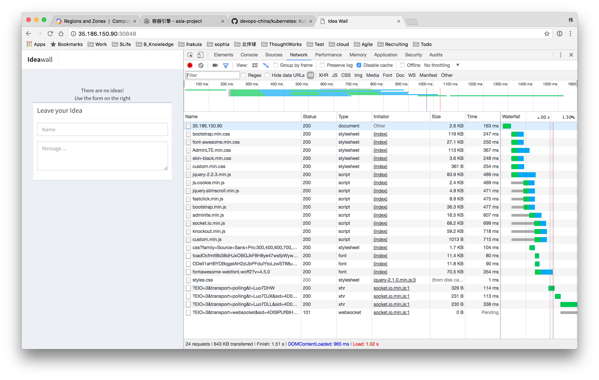
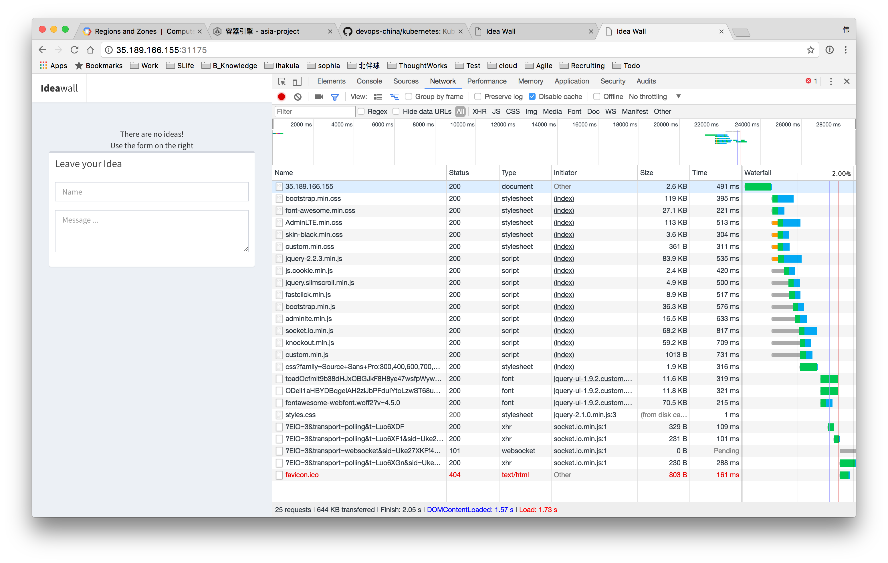
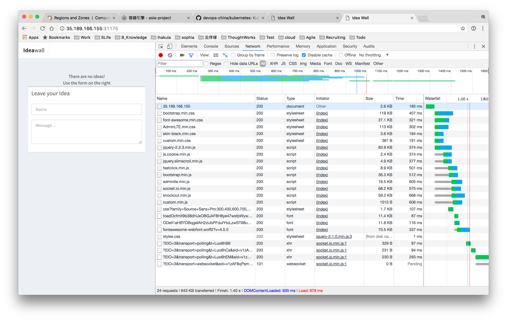
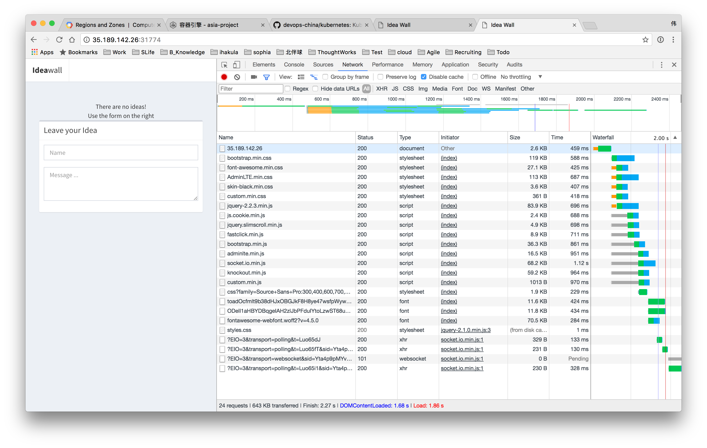
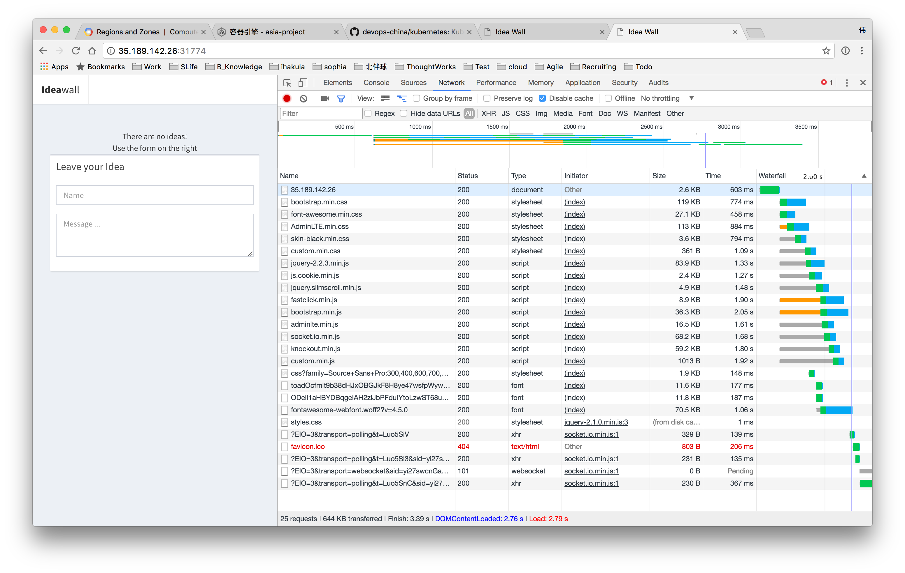

# Steps

# Idea Wall
This awesome application lets you post ideas, to a wall.  Clue is in the name, hey?

This application is not actually a genuine app, it's to be used in the docker/kubernetes workshop.

## Dependencies
This application writes its data to Redis, so you need to have a redis to connect it to.

## Building & Running
The following steps will get you into a working state:

  - `npm install`
  - `npm run assets`
  - set environment variables `REDIS_HOST` and `REDIS_PASSWORD` to the right values
  - `npm run start`

The application should then be on http://127.0.0.1:9000

### Issues found

* eu-west1-c region not found

---

### Deploy 

1. install gcloud sdk
2. install terraform
3. gcloud auth login
4. ./deploy.sh

### Support China 

|  | gcloud | terraform | kubectl | service | 
| ------| ------ | ------ | ------ | ------ |
| **office** | &#10004; | &#10004; | &#10004; | &#10004; |
| **home** | &#65794; | &#65794; | &#65794; | &#65794; |

### Asia Region Service Accessing

|Region\Action  | Office TW VPN(Xian DC) | Office | Home | Home TW VPN(Xian DC) | 
| ------| ------ | ------ | ------ | ------ |
| **Asia-southeast1** |  |  | &#10004; | &#10004; |
| **Asia-east1** |  |  | &#65794; | &#65794; |
| **Asia-northeast1** |  |  | &#65794; | &#65794; |

### Asia Region Dev building service - kubectl get pods > /dev/null 

|Region\Action  | Office TW VPN(Xian DC) | Office | Home | Home TW VPN(Xian DC) | 
| ------| ------ | ------ | ------ | ------ |
| **Asia-southeast1** | 0.13s user  0.02s system  22% cpu  0.631 total | 0.13s user  0.02s system  30% cpu  0.494 total | &#10004; | &#10004; |
| **Asia-east1** | 0.42s user  0.07s system  53% cpu  0.905 total | 0.13s user  0.02s system  25% cpu  0.594 total | &#65794; | &#65794; |
| **Asia-northeast1** | 0.13s user  0.02s system  16% cpu  0.841 total | 0.44s user  0.08s system  31% cpu  1.643 total | &#65794; | &#65794; |